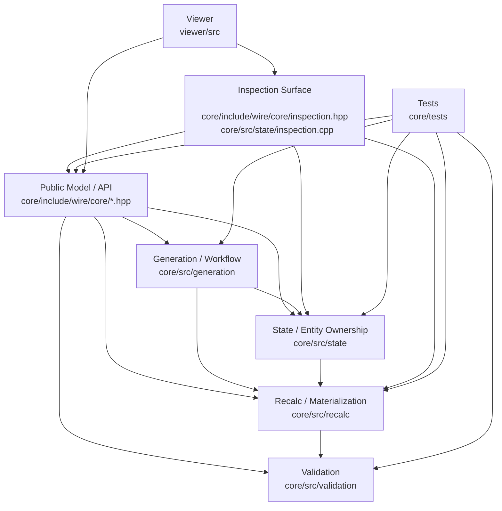
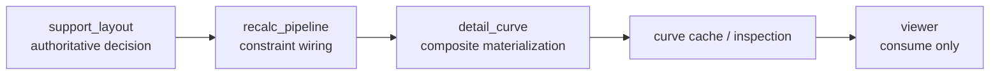

# core_layers.md

## Core Layer Map

```mermaid
flowchart TD
  api["Public Model / API
  core/include/wire/core/*.hpp"]

  state["State / Entity Ownership
  core/src/state"]
  generation["Generation / Workflow
  core/src/generation"]
  recalc["Recalc / Materialization
  core/src/recalc"]
  validation["Validation
  core/src/validation"]
  tests["Tests
  core/tests"]
  inspection["Inspection Surface
  core/include/wire/core/inspection.hpp
  core/src/state/inspection.cpp"]
  viewer["Viewer
  viewer/src"]

  api --> state
  api --> generation
  api --> recalc
  api --> validation

  generation --> state
  generation --> recalc
  state --> recalc
  recalc --> validation

  inspection --> api
  inspection --> state
  inspection --> recalc

  tests --> api
  tests --> state
  tests --> generation
  tests --> recalc
  tests --> validation

  viewer --> api
  viewer --> inspection
```

## High-Difference Curve Path

```mermaid
flowchart LR
  support["support_layout
  authoritative decision"]
  pipeline["recalc_pipeline
  constraint wiring"]
  detail["detail_curve
  composite materialization"]
  cache["curve cache / inspection"]
  viewer["viewer
  consume only"]

  support --> pipeline --> detail --> cache --> viewer
```
